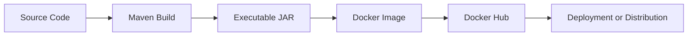
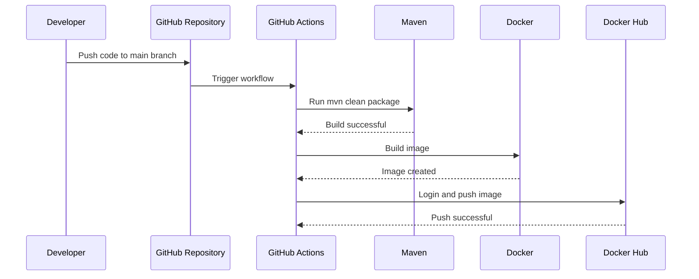

<!--
  Academic project report for the DevOps CI/CD pipeline project.
  Written in formal language for university submission.
-->
# Project Report: DevOps CI/CD Pipeline Using Java, Maven, Docker, and GitHub Actions

## 1. Introduction

Continuous Integration and Continuous Deployment are essential practices in modern software engineering. This project demonstrates an automated pipeline that builds, packages, containers, and deploys a Java application using Maven, Docker, and GitHub Actions.

## 2. Problem Statement

Manual build and deployment processes are slow, error-prone, and difficult to repeat consistently. A structured CI/CD pipeline reduces human error, improves delivery speed, and ensures that each build is validated before deployment.

## 3. Objectives

- Create a Java application that can be built using Maven.
- Generate an executable JAR file.
- Package the application inside a Docker container.
- Automate the process using GitHub Actions.
- Push Docker images to Docker Hub securely using secrets.

## 4. Technologies Used

- Java 17
- Maven
- Docker
- GitHub Actions
- GitHub Secrets

## 5. System Architecture

The system consists of source code, Maven build automation, Docker containerization, and GitHub Actions workflow automation.



## 6. Workflow Diagram



## 7. Implementation Steps

1. Created a simple Java 17 console application.
2. Configured Maven for compilation, testing, and JAR packaging.
3. Added an executable manifest to the JAR.
4. Wrote a Dockerfile using a lightweight OpenJDK 17 base image.
5. Added a GitHub Actions workflow to automate build and image publishing.

## 8. GitHub Actions Pipeline Explanation

The workflow runs on pushes to the main branch. It checks out the code, sets up Java 17, builds the project with Maven, displays success logs, logs in to Docker Hub using repository secrets, builds the Docker image, and pushes it with both `latest` and commit-based tags.

## 9. Docker Explanation

Docker packages the Java application and its runtime dependencies into a portable container image. This ensures consistent execution across different environments.

## 10. Maven Explanation

Maven automates project compilation, dependency resolution, testing, and packaging. In this project, Maven also creates an executable JAR that can be run directly or copied into a Docker image.

## 11. Results and Output

The application prints the following output when executed:

```text
CI/CD Pipeline Working Successfully
```

The Maven build completes successfully and produces the executable JAR file. The Docker image can then be built and run locally or pushed to Docker Hub.

## 12. Screenshots Placeholders

- Screenshot of Maven build success
- Screenshot of application output in terminal
- Screenshot of Docker image build
- Screenshot of GitHub Actions workflow execution
- Screenshot of Docker Hub repository

## 13. Conclusion

This project successfully demonstrates an end-to-end DevOps CI/CD pipeline. It shows how automation improves software delivery quality, consistency, and repeatability.

## 14. Future Scope

- Add code quality checks and static analysis.
- Introduce versioned Docker releases.
- Deploy to a cloud platform.
- Extend the application with more features and REST APIs.