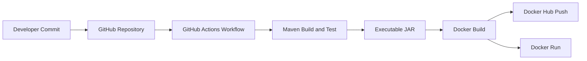

# CI/CD Pipeline for a Java Maven Docker Project

This project demonstrates a professional DevOps workflow for a Java 17 application built with Maven, containerized with Docker, and automated through GitHub Actions. The application prints:

```text
CI/CD Pipeline Working Successfully
```

## Project Overview

The repository shows how source code moves from a developer commit to a validated Maven build, packaged executable JAR, Docker image, and optional Docker Hub publication.

## Features

- Java 17 application with a simple console output.
- Maven build automation with executable JAR packaging.
- Lightweight Docker image with a non-root runtime user.
- GitHub Actions pipeline with Docker Hub push support.
- Clear documentation for build, run, and deployment steps.

## Architecture Diagram



## Technologies Used

- Java 17
- Maven
- Docker
- GitHub Actions
- GitHub Secrets

## Setup Instructions

1. Clone the repository.
2. Install Java 17, Maven, and Docker.
3. Run `mvn clean package` to create the executable JAR.
4. Build the Docker image.
5. Run the container locally or push the image through GitHub Actions.

## Maven Build Commands

```bash
mvn clean package
mvn clean verify
java -jar target/cicd-project-1.0.jar
```

## Docker Commands

```bash
docker build -t cicd-project:latest .
docker run --rm cicd-project:latest
```

To push manually to Docker Hub:

```bash
docker tag cicd-project:latest <dockerhub-username>/cicd-project:latest
docker push <dockerhub-username>/cicd-project:latest
```

## GitHub Actions Explanation

The workflow in [`.github/workflows/main.yml`](.github/workflows/main.yml) triggers on pushes to `main` and on manual dispatch. It checks out the repository, sets up Java 17, runs `mvn clean package`, shows success logs, logs in to Docker Hub using GitHub Secrets, builds the Docker image, tags it properly, and pushes both `latest` and commit-specific tags.

### Required Secrets

- `DOCKER_USERNAME`: Your Docker Hub username.
- `DOCKER_PASSWORD`: Your Docker Hub access token or password.

## Screenshots

Add screenshots here during submission:

- Maven build output
- Docker image build output
- GitHub Actions workflow run
- Docker Hub repository showing pushed image

## Future Improvements

- Add application logging and structured log output.
- Publish versioned Docker tags on Git tags.
- Add static code analysis and security scanning.
- Extend the app with REST endpoints and health checks.

## Conclusion

This project provides a clean and practical example of a CI/CD pipeline that turns Java source code into a tested artifact and container image using Maven, Docker, and GitHub Actions.
