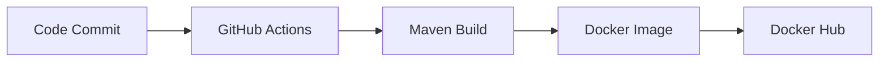

<!--
  Concise project synopsis for academic submission.
-->
# Project Synopsis

## Project Title

Automated CI/CD Pipeline for a Java Maven Docker Application Using GitHub Actions

## Problem Statement

Manual software build and deployment workflows are inefficient and inconsistent. This project addresses the need for a repeatable, automated DevOps pipeline.

## Objectives

- Build a Java 17 application using Maven.
- Package the application as an executable JAR.
- Containerize the application using Docker.
- Automate builds and Docker publishing with GitHub Actions.

## Tools and Technologies

- Java 17
- Maven
- Docker
- GitHub Actions
- GitHub Secrets

## Workflow Diagram

## Expected Outcome

The pipeline should automatically compile the application, run the build command, package the JAR, create a Docker image, and push the image to Docker Hub when valid secrets are configured.

## Conclusion

The project demonstrates practical DevOps automation for Java applications and provides a foundation for more advanced deployment workflows.